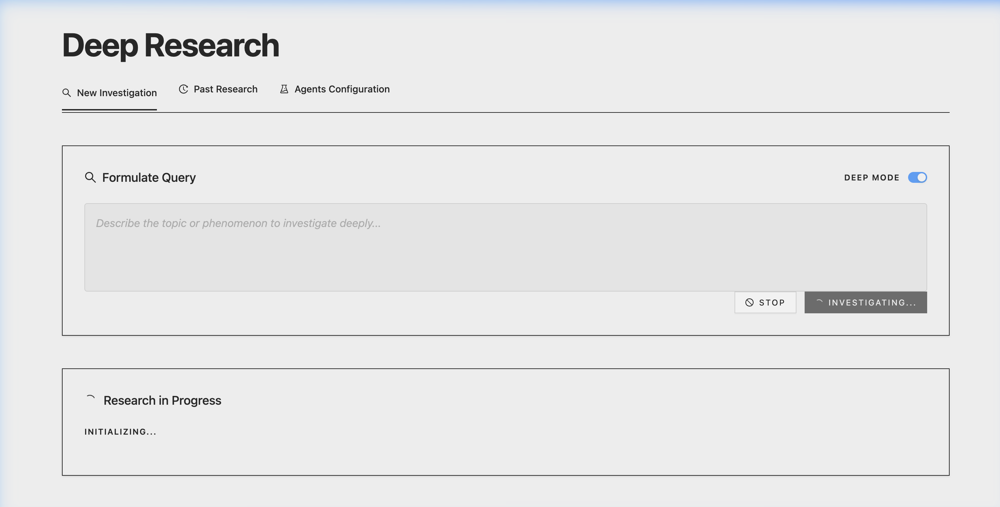

# Deeper Research

Deeper Research is an AI-powered research assistant that performs deep, multi-step analysis on any topic using OpenAI and DeepSeek models. It provides a comprehensive and structured output based on the research results.



## Features

- **Deep AI Research**: Leverages advanced LLMs to perform thorough research.
- **Modern UI**: Sleek, dual-tone aesthetic built with React, Tailwind CSS (v4), and Ant Design.
- **Node.js Backend**: Robust Express server handling research logic and API integrations.

## Tech Stack

- **Frontend**: React, Vite, Tailwind CSS, Ant Design, TanStack Query.
- **Backend**: Node.js, Express, OpenAI SDK, DeepSeek API.

## Getting Started

### Prerequisites

- Node.js (v18 or later)
- API keys for OpenAI and/or DeepSeek

### Installation

1. Clone the repository.
2. Install dependencies for both backend and frontend:
   ```bash
   cd backend && npm install
   cd ../frontend && npm install
   ```
3. Set up your environment variables in a `.env` file in the `backend` directory.
4. Start the development servers:
   - Backend: `npm run dev` (from `backend` folder)
   - Frontend: `npm run dev` (from `frontend` folder)
